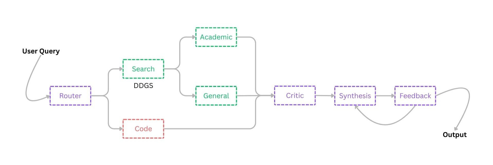

# ResearchRAGAgent

A multi-agent RAG (Retrieval-Augmented Generation) system designed to conduct research, synthesize findings, and answer questions by leveraging both real-time web search and a local codebase.

The application uses a "team" of AI agents, each with a specific role, to route queries, retrieve information, critique sources, and generate comprehensive, cited reports. It features a self-correction loop and an explainable QA bot for follow-up questions.



## Key Features

* **Multi-Agent Architecture:** Utilizes a team of specialized agents (Router, Searcher, Critic, Synthesizer, etc.) for a robust, modular workflow.
* **Hybrid RAG:**
    * 1. **Web RAG:** Performs real-time web searches, with a focus on academic sources (arXiv, JMLR, ACM, etc.) for technical queries.
    * 2. **Code RAG:** Embeds a local Python codebase using `nomic-embed-text` and `ChromaDB` for context-aware code-related answers.
* **Critical Filtering:** A `Critic Agent` reviews all retrieved web snippets to filter out irrelevant or low-quality results before synthesis.
* **Self-Correction Loop:** A `Feedback Agent` acts as a supervisor, reviewing the final report and forcing a re-generation if the quality is poor.
* **Explainable QA:** After a report is generated, a `QA Bot` is available to answer follow-up questions based only on the information in the report.
* **Interactive UI:** Built with Streamlit for ease of use, including code embedding setup and chat history.

## Architecture: The Agentic Workflow
The core of this project is a "Chain of Agents" that mimics a research process.

### Step 1: Router Agent
* File: `agents.py` (uses `ROUTER_PROMPT` from `prompts.py`)
* Purpose: To act as the initial dispatcher. It classifies the user's query into one of three categories:
  * `academic_research`: For scientific papers, technical concepts, etc.
  * `code_search`: For questions about the user's local code.
  * `general_search`: For all other queries (news, opinions, etc.).

### Step 2: Parallel Data Retrieval
Based on the router's decision, the system retrieves information from two sources simultaneously.
* #### Search Agent (Web)
  * **File:** `agents.py` / `tools.py`
  * **Purpose:** To find relevant public information. It uses the `ddgs` (DuckDuckGo Search) library.
  * **Logic:** If the query is `academic_research`, the search is automatically restricted to sites defined in `config.py` (e.g., `site:arxiv.org`, `site:jmlr.org`).

* #### RAG Agent (Code)
  * **File:** `agents.py` / `rag.py`
  * **Purpose:** To find relevant snippets from the user's local codebase (if it has been embedded).
  * **Logic:** Uses a Chroma vector store (created by rag.py) to find the top k most similar code chunks to the user's query.

### Step 3: Critic Agent
* **File:** `agents.py` (uses `CRITIC_PROMPT` from `prompts.py`)
* **Purpose:** To filter noise and improve the quality of the final report.
* **Logic:** The agent reads all web search snippets and the user's query. It then returns a comma-separated list of the indices of the only snippets that are relevant and high-quality (e.g., "1, 4, 5"). Any snippets it rejects are discarded.

### Step 4: Synthesis Agent
* **File:** agents.py (uses `SYNTHESIS_PROMPT` from `prompts.py`)
* **Purpose:** To write the final, comprehensive report.
* **Logic:** This agent receives three types of context:
  * The original query.
  * The critic-approved web snippets.
  * The relevant code snippets (if any). It is instructed to synthesize a single answer, citing web sources with `[Source X]` and referring to code context as "in your local codebase."

### Step 5: Feedback Agent (Self-Correction Loop)

* **File:** `agents.py` (uses `FEEDBACK_PROMPT` from `prompts.py`)
* **Purpose:** To act as a "supervisor" and perform quality control.
* **Logic:** This agent reviews the original query and the newly generated report.
  * If the report is good, it responds with "Yes." and the process finishes.
  * If the report is incomplete or inaccurate, it responds with "No. [concise feedback...]."
  * The main app (`app.py`) detects the "No." and automatically re-runs the Synthesis Agent (Step 4), this time providing the feedback as additional context.

### Step 6: Explainable QA Bot
* **File:** `agents.py` (uses `QA_PROMPT` from `prompts.py`)
* **Purpose:** To answer follow-up questions about the generated report.
* **Logic:** This agent is strictly sandboxed. It receives only the final report and the user's new question, and is instructed to answer only using information found in that report.

## How to Run
### 1) Prerequisites (Install Ollama)

This project requires [Ollama](https://ollama.com/download) to be running locally.

After installing Ollama, you must pull the models used by the application:
```shell
# The main LLM for generation (configurable in prompts.py)
ollama pull mistral

# The model for embedding the code (configurable in rag.py)
ollama pull nomic-embed-text
```

### 2. Installation
**Clone this repository:**
```shell
git clone [https://github.com/your-username/ResearchRAGAgent.git](https://github.com/your-username/ResearchRAGAgent.git)
cd ResearchRAGAgent
```

**Install the required Python packages:**
```shell
pip install -r requirements.txt
```


### 3. Running the Application

Ensure your Ollama application is running in the background.

**Run the Streamlit app:**
```shell
streamlit run app.py
```


### 4. First-Time Setup (Embedding Your Code)

To allow the agent to reference your local code, you must first embed it:

* In the Streamlit sidebar ("Code RAG Setup"), enter the path to a directory containing your Python files (e.g., `./` for the project's own code, or `../project_folder`).
* Click the "Load & Embed Code" button. A "Code RAG is Active" message will appear.
* You can now ask questions that reference your code, like "How does the 'transformer.py' file relate to the **'Attention is All You Need'** paper?"

## Configuration

You can customize the application by editing the following files:

* **`prompts.py`:**
  * `OLLAMA_MODEL`: Change `mistral` to any other model you have pulled in Ollama (e.g., llama3:8b-instruct).
  * All agent prompts can be refined here.
* **`rag.py`:**
  * **`EMBEDDING_MODEL`:** Change `nomic-embed-text` to another Ollama embedding model.
  * Tweak `chunk_size` and `chunk_overlap` in the `RecursiveCharacterTextSplitter`.
* **`config.py`:**
  * `SEARCH_RESULT_COUNT`: Change the number of results `ddgs` retrieves.
  * `ACADEMIC_SEARCH_SITES`: Add or remove academic sites for focused search.

## License

This project is licensed under the MIT License. See the [LICENSE](LICENSE) file for details.